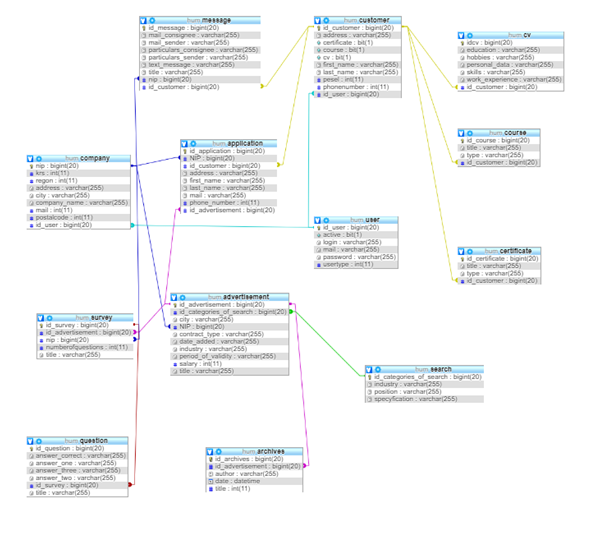

# Backend for classified job ads website

## Technologies

Java 8, Spring, JPA, Hibernate and MySQL

## functions:

### Everyone can:
 
- view job offers
- view CV
- log in 
- create an account (basic and company account or basic and customer account)  
- view statistics 
- send feedback to admin 

### Company can:

- add job offers
- check applications 
- view account 
- view their job offer 

### Basic account can:

- send application for job offer
- create cv
- advertise your cv 
- view account 

### Admin can: 

- delete an account
- block an account 
- give someone a premium account 
- view accounts 

## Database model

